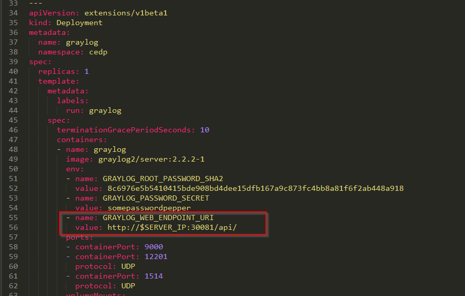
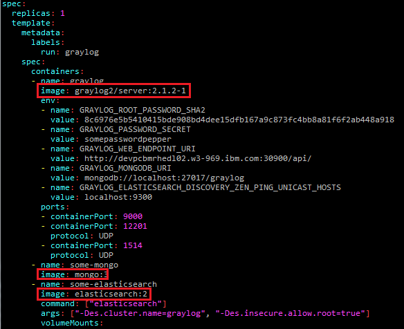
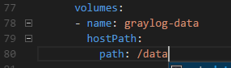
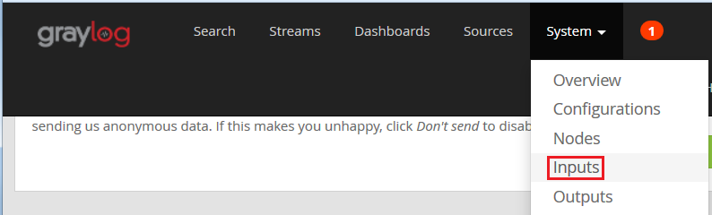
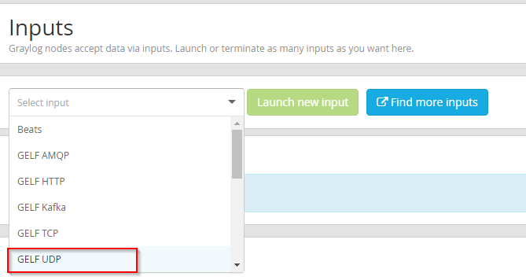
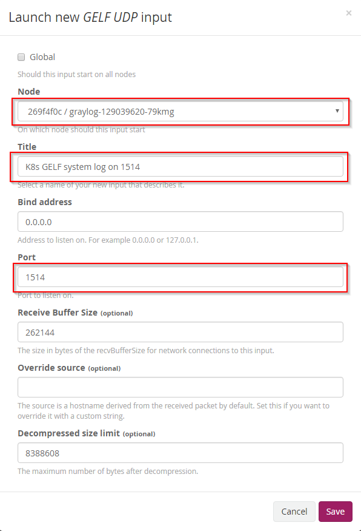
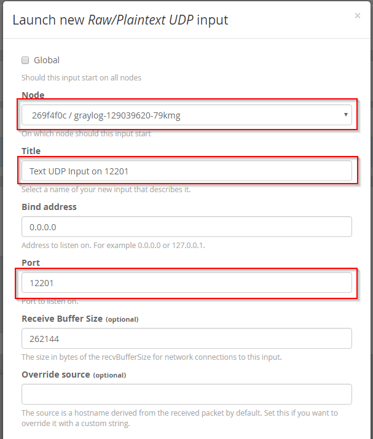
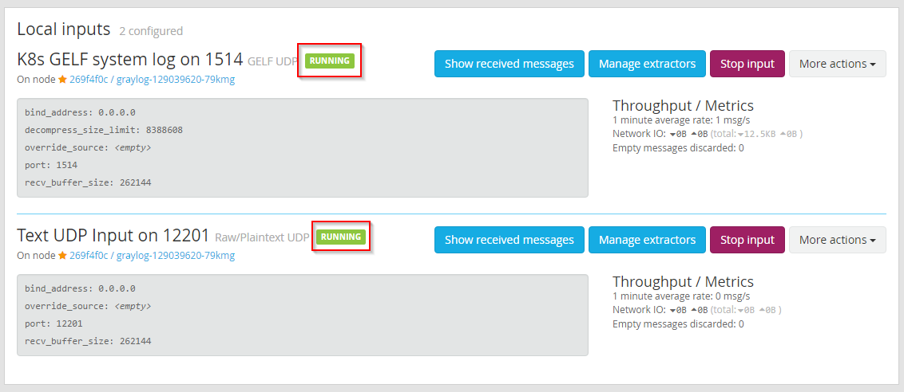
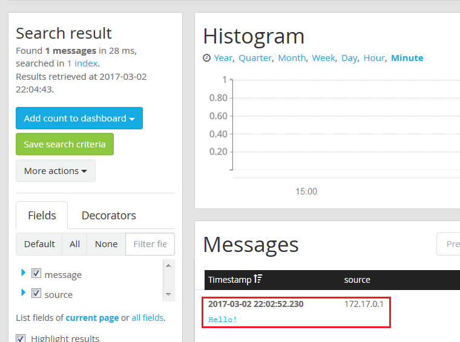

# Install and Setup Guide for Graylog (via Kubernetes)

The install process is relatively straightforward and uses Kubernetes' `kubectl` utility to process a provided YAML script, [graylog.yml](/ansible/playbooks/cedp_stack/roles/cedp/graylog/pod/files/graylog.yml). This script will deploy the necessary containers and expose the required service ports for the logging system. Once Graylog is set up, its web UI can be used to further configure the system, including the creation of `Inputs` so that it can receive log messages sent in from other systems and applications.

## 1. Installing Graylog 

This section is for reference only as the Ansible playbook configures and deploys the Graylog resources and pod.

### 1.1 Check Primary Node URL

Locate the [graylog.yml](/ansible/playbooks/cedp_stack/roles/cedp/graylog/pod/files/graylog.yml) script (see link for git path).

Find the URL listed for the `GRAYLOG_WEB_ENDPOINT_URI` environment variable. Ensure that its setting is correct for the environment. If it is not, edit it. The port must remain `30081`, and the machine name or IP should be the Kubernetes cluster's primary node.



### 1.2 Edit the Image Names

Check that the image names for the `Elastic Search`, `Mongo`, and `Graylog` containers are correct for the environment, and edit if necessary.



### 1.3 Create the Persistent Data Subfolders

This assumes that a persistent Volume Mount is stored at `/data` on the Kubernetes nodes.



1. Create the following directories. Ensure that the user that the docker containers are running as have full read/write permissions for `/data` and these subdirectories:

  ```
  /data/gl-journal
  /data/gl-config
  /data/gl-elastic
  /data/gl-mongo
  ```

2. Copy the following configuration files to the `/data/gl-config` directory, modifying the files as necessary.  

  - [cognitive-data-platform/ansible/playbooks/cedp_stack/roles/cedp/graylog/files/files/graylog.conf](/ansible/playbooks/cedp_stack/roles/cedp/graylog/files/files/graylog.conf)

  - [cognitive-data-platform/ansible/playbooks/cedp_stack/roles/cedp/graylog/files/files/log4j2.xml](/ansible/playbooks/cedp_stack/roles/cedp/graylog/files/files/log4j2.xml)

3. In the graylog.conf replace `$SERVER_IP` in the following line 

    ```
    rest_transport_uri = http://$SERVER_IP:30081/api/ 
    ```

### 1.4 Use kubectl to deploy the pod

```bash
$ kubectl create -f graylog.yml
```

## 2. Configuring Graylog Inputs

The Graylog Web UI can be accessed via a web browser using the machine / port # that was used for the `GRAYLOG_WEB_ENDPOINT_URI` in the `graylog.yml` file (without the trailing `/api`).

For example:

```
http://9.4.141.217:30081
```

Sign in using `admin`/`admin` for the `username`/`password`.

#### 2.1.1 Create the Inputs

Navigate to the Inputs screen by selecting Inputs from the System menu in the navigation bar.



In the `Select Input` dropdown, choose `GELF UDP` and then hit the `Launch new input` button.



On the screen that follows, provide the following input, and then hit the `Save` button:

Modify the following values leaving the others as default

| Field | Value |
| ----- | ----- |
| Node | Select the one node entry that appears in the dropdown. |
| Title | K8s GELF system log on 1514 |
| Port | 1514 |



Repeat the process to create another input, except this time for the `Select Input` type when launching the new input choose `Raw/Plaintext UDP`. On the information input screen, use the following parameters:

Modify the following values leaving the others as default

| Field | Value |
| ----- | ----- |
| Node | Select the one node entry that appears in the dropdown. |
| Title | Text UDP Input on 12201|
| Port | 12201 |



#### 2.1.2 Verify the Inputs

If the creation of the Inputs was successful, they should now be displayed on the Inputs screen under the `Local inputs` section, and they should be in `RUNNING` status:



Try sending a message via UDP to the log server. One way to do this is: From a bash shell that can access the machine, run the following command (change the IP shown to the machine IP of the log server)

```bash
$ echo 'Hello!' > /dev/udp/192.168.99.100/30300
```

Click on the `Show received messages` button for the `Text UDP Input on 30300` input. If the message was successfully received, it should be shown in the `Messages` section:



##  3. Ensure Ports are Open

Note that the Graylog web UI and the Input listeners require their respective ports to be open on the Kubernetes' nodes. The firewall should allow traffic in on the following ports:

| Port  | Purpose |
| ----- | ----- |
| 30081 | Graylog web interface |
| 30300 | UDP text input |
| 30301 | Syslog UDP input |

