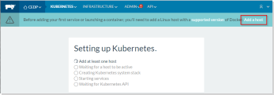
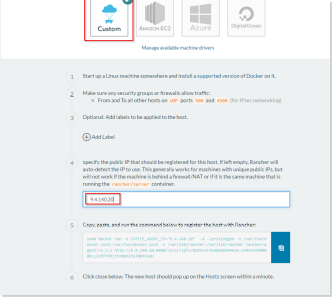
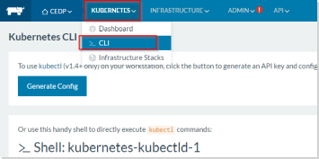

# Cluster Deployment Documentation (Rancher)

## Deployment
Following these instructions will result in a deployment with a Nexus repository for docker images and a Kubernetes cluster Running on Rancher with Graylog set up to collect logs and Zabbix to collect metrics.

### 1. Prerequisites
- Complete the setup instructions located here: [ZC2 Infrastructure Setup.md](/documentation/CEDP%201.0%20Alpha/ZC2 Infrastructure Setup.md).

*NOTE: When opening ports for a Rancher environment also open port 8080.*

### 2. Rancher Install
1. Add the following to `/etc/ansible/hosts` and fill in the hosts as described (if the directory and file do not exist, create as root).

    ```ini
    [servers:children]
    nexus
    kubernetes-all
    
    [nexus]
    # Add nexus hostname or ip address here
    # <instanceName>.<projectName>.zc2.ibm.com
    # Kube-1.clamb.zc2.ibm.com
    
    [kubernetes-all:children]
    kubernetes-master
    kubernetes-minion
    
    [kubernetes-master]
    # Add master node hostname or ip address here
    
    [kubernetes-minion]
    # Add all minion hostnames or ip addresses here
    ```

2. Ensure that `host_key_checking = False` in `/etc/ansible/ansible.cfg` to automatically add ssh fingerprints when connecting to new systems for the first time. If the file does not exist create it as root. It should look like:  

    ```ini
    [default]
    host_key_checking = False
    ```

    > ***NOTE:*** If you do not set this value then you must ensure it is possible to ssh to each server individually and add the fingerprints manually:
    > Eg. For Zurich you would:
    > - `ssh ubuntu@<instanceName>.<projectName>.zc2.ibm.com`
    > - accept key for each server
    > - `exit` after a successful ssh

3. Copy [script_vars.yml.example](/ansible/playbooks/cedp_stack/script_vars.yml.example) to `script_vars.yml`, then review the settings within and modify any values as needed. 

4. Run the install command from the playbook directory from the project root: `/ansible/playbooks/cedp_stack`
    - For Zurich Ubuntu systems: `ansible-playbook -u ubuntu install_rancher.yml`
    - For other systems, replace `ubuntu` with the name of a user that has the necessary access as described in the prerequisites above.

    > ***NOTE:*** If using the Vagrant image provided in this project as the ansible control system, you can find all the project artifacts already mount in the `/vagrant` folder.

### 3. Rancher Setup

#### 3.1 Add Cattle

1. Navigate to the Rancher dashboard: `http://<rancher server ip>:8080`
2. Click `Add a host`

  

3. On the next screen click `Save` without changing any values.
4. On the `Add Host` screen, leave `Custom` selected at the top and add the IP address of one node in the cluster.
5. Copy the output in `#5` and run it on the host

  

6. Repeat the previous step for each Kubernetes node in the cluster, then click `Close`.

  You will now see the Kubernetes cluster starting. Click on the `Infrastructure` menu, then `Hosts` to view the progress.

  This step can take time to complete, usually 5-10 minutes.

#### 3.2 Get Kubernetes config

1. When the host setup is complete, select `Kubernetes` -> `CLI` from the top menu.

  

2. Click the `Generate Config` button to create the configuration file needed to connect via `kubectl`.
3. On the Ansible host, create the config file in the correct directory:

  ```bash
  $ mkdir ~/.kube
  $ vi ~/.kube/config.<IP OF THE MASTER NODE>
  ```

  Be sure to replace `<IP OF THE MASTER NODE>` with the ip address of the kubernetes master node.

4. Copy the generated config from rancher into this file.


### 4. Kubernetes Deployment 

Complete the install with the second ansible playbook. Run the command from the playbook directory from the project root: `/ansible/playbooks/cedp_stack`

For Zurich Ubuntu systems:

```bash
$ ansible-playbook -u ubuntu install_to_rancher.yml
```

