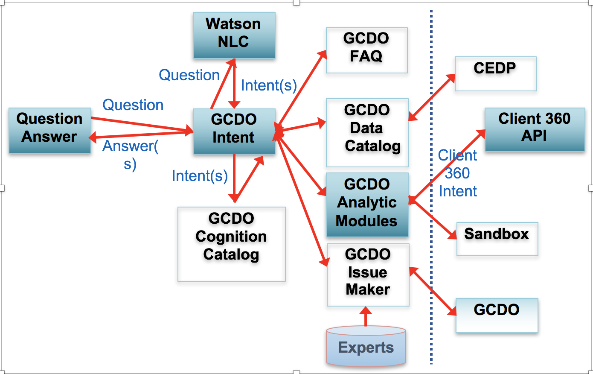
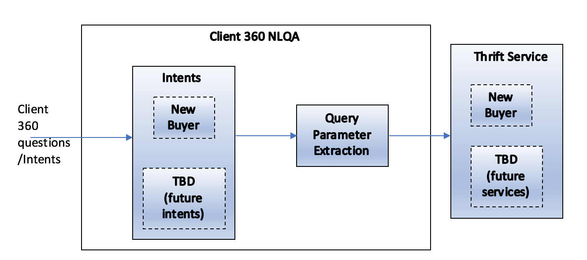

# CaaS Module for Client 360 NLQA

## Architecture, Design and Overview
Client 360 NLQA module is one of the components of CaaS analytic module. This module deals with answering natural language-based questions related to client 360 project. Client 360 aims at providing information on IBM clients. It is responsible for answering questions on IBM client, such as a client's global identifier (DUNS number), geo-location and business devisions, revenue information, current business transactions and orders with IBM etc. 

Below is the architecture diagram of client 360 NLQA component within CaaS

 

The following diagram shows the components of Client 360 NLQA - 

### Intents

The NLQA module will register client 360 question intents. Each intent will be trained with a number of variants of the original question. Intents that will be built (for current release) and in the future are the following - 

- New buyer/client
- GOE
- Client's Net Promoter Score (NPS)
- Go to market strategy for clients
- Business opportunities with clients

#### Training Steps

Please follow instructions in [Building a Module](../Building%20a%20Module.md) 

### Query Parameter Extraction

This module will be responsible for extracting parameters or entities from the natural language questions. These extracted information will be used as parameters to thrift service endpoints (if required by the service definitions). Different intents will have different types of parameters to extract. For example, New buyer/client and GOE intents will require extracting names of the clients from questions like - 

- Do we have Client X as new buyer? 
- Is Client X a GOE? 

We use Watson Natural Language Understanding (NLU) for extracting entities from questions. Under config directory in client-360-service module, the configuration file "natural-language-understanding.properties" contains all the required configurations for accessing the NLU service. User should create a NLU service via [bluemix](https://console.ng.bluemix.net), generate service credentials. User should use the generated username and password as bluemixUserName and bluemixPassword in the natural-language-understanding.properties file.
  
### Thrift Service

This service endpoints serve as answers to the client 360 NL questions. For New Buyer use case, the client 360 endpoint service is hosted at "cps.cogsys.zurich.ibm.com/cps/1.0/buyers/new". The details of the service can be found at [client profile API](../../CEDP%200.5/CEDP%200.5%20Client%20Profile%20Services%20API.md). User needs to follow the steps mentioned in this documentation to generate access_token. Once access_token is generated, user can use the value in the client-api.properties file located in the config.
  
### UI

Client 360 NLQA will be exposed via UI. [UI design](./Client360UI.md) captures the design.

## Client 360 Questions

CEDP 1.0 beta release will be based on the following client 360 questions - 
- How many net new client do we have?
- How many new buyers do we have?

### Thrift Endpoint URLs

TBD

## Assumption

As of now, client 360 questions will be directed to answers based on certain assumptions. Since CEDP 1.0 beta release will not have conversation/dialog module, the ambiguous questions by users will be directed to answers based on assumptions, and not by opening up dialogs of conversations with the user to clarify the ambiguities. For example, if a user asks about the number of net new clients IBM has, the answers will be based on assumptions on a timeline. It will respond only the number of new clients since the assumed time.