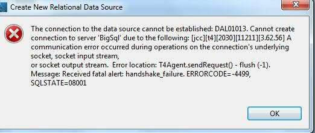
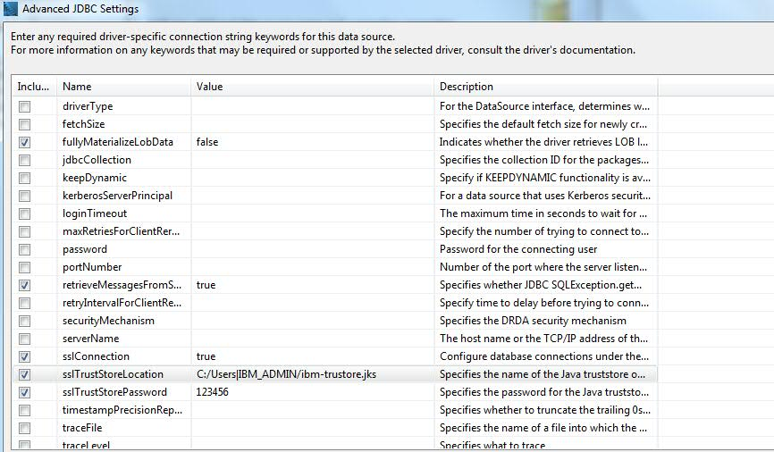
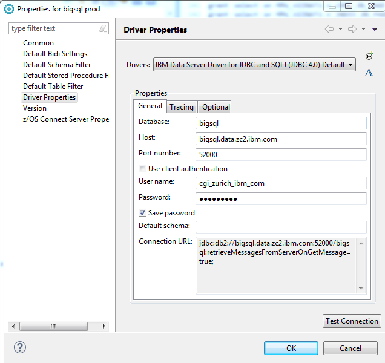
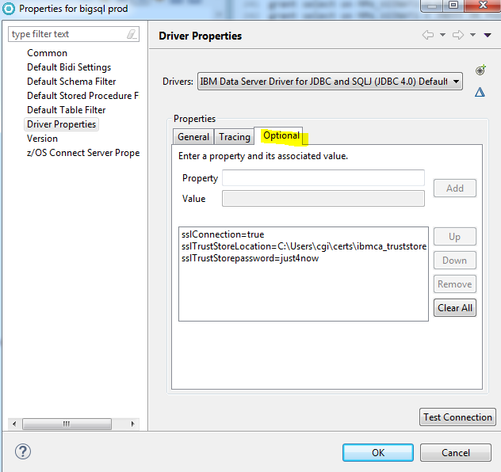

# Commonly Used Tools for Connecting to CEDP Databases

This section provides tips for configuring CEDP databases using the more commonly used tools.

###JDBC Drivers

Many tools utilize the DB2 JDBC driver. As *the most common source of connection problems involve the use of an old DB2 driver, it is extremely important to consult the [section on JDBC](JDBC.md). 

***

### Squirrel SQL

The default IBM DB2 Universal Driver installed with Squirrel does not support TLS.

It is essential that the driver is upgraded with the most recent DB2 JDBC driver.

***

### QMF

It is essential that the configured DB2 driver type is the latest db2jcc4.jar  "DB2 Type 4".
If the correct driver is not configured, the following error message may be displayed:



When creating the connection to BigSQL, select the type 4 DB2 JDBC driver :

  Go to View -> Preferences -> JDBC Libraries -> DB2 -> DB2 Type 4 UDP Driver.

  If db2jcc4.jar is not listed, add this JAR file.

Be sure to specify your w3 credentials for the password and replace '@' and '.' in your w3id with '_'.

To configure the TLS parameters, click on "Advanced" :
  Check sslConnection and set to true
  Check sslTrustStoreLocation and enter the full path to your truststore (the *.JKS file that you created as described above in section JDBC)
  Check sslTrusStorePassword and enter the password that you used when you created the truststore

For example:




Click on Test Connection

***

### Eclipse Data Tools

Various products such as Rational Application Developer and IBM Data Studio are based on the Eclipse Data Tools component. The following screenshots display the BigSQL connection configured with TLS.

Basic connection properties:



Select the "Optional" tab in order to add the TLS and truststore parameters:



***

### DB2 Client

We recommend using the DB2 for 64bit with the latest fix pack installed for your version of DB2.

DB2 for 32bit does not seem to work at least not in all circumstances.
Create Truststore

Create keystore directory in your home directory:

Linux:
```
mkdir ~/GSK8Store
cd ~/GSK8Store
```

Windows:
```
mkdir C:\Users\IBM_ADMIN\GSK8Store
cd C:\Users\IBM_ADMIN\GSK8Store
```

Create the keystore in your keystore directory:

Linux:
```
/opt/ibm/db2/V11.1/gskit/bin/gsk8capicmd_64 -keydb -create -db "keyclient.kdb" -pw "<PASSWORD>" -stash
/opt/ibm/db2/V11.1/gskit/bin/gsk8capicmd_64 -cert -add -db "keyclient.kdb" -pw "<PASSWORD>" -label "carootcert" -file carootcert.der -format binary -fips
/opt/ibm/db2/V11.1/gskit/bin/gsk8capicmd_64 -cert -add -db "keyclient.kdb" -pw "<PASSWORD>" -label "caintercert" -file caintermediatecert.der -format binary -fips
```

Windows:
Install GSKit V8 first: http://www-01.ibm.com/support/docview.wss?uid=swg21631462 (In case you have trouble to login to FixCentral, here is the link to where IBM employees can login: https://www-945.ibm.com/support/fixcentral/ac/options).

```
"C:\Program Files\IBM\gsk8\bin\gsk8capicmd_64.exe" -keydb -create -db "keyclient.kdb" -pw "<password>" -stash
"C:\Program Files\IBM\gsk8\bin\gsk8capicmd_64.exe" -cert -add -db "keyclient.kdb" -pw "<password>" -label "carootcert" -file carootcert.der -format binary -fips
"C:\Program Files\IBM\gsk8\bin\gsk8capicmd_64.exe" -cert -add -db "keyclient.kdb" -pw "<password>" -label "caintercert" -file caintermediatecert.der -format binary -fips
```

DB2 Client dbm configuration

Open a DB2 Command Window and run the following commands:
Linux:
```
db2 update dbm cfg using SSL_CLNT_STASH <full path to your home>/GSK8Store/keyclient.sth
db2 update dbm cfg using SSL_CLNT_KEYDB <full path to>/GSK8Store/keyclient.kdb
```

Windows:
```
db2 update dbm cfg using SSL_CLNT_STASH C:\Users\IBM_ADMIN\GSK8Store\keyclient.sth
db2 update dbm cfg using SSL_CLNT_KEYDB C:\Users\IBM_ADMIN\GSK8Store\keyclient.kdb
```

Catalog DB (BIGSQL)

In the DB2 Command Window run the following commands:
```
db2 CATALOG TCPIP NODE CEDP REMOTE c04n1.i.zc2.ibm.com SERVER 52000 security ssl
db2 CATALOG DATABASE BIGSQL AS BIGSQL AT NODE CEDP
```

Connect

In the DB2 Command Window run the following command:
```
db2 connect to BIGSQL user <USERNAME>
```
or
```
db2 connect to BIGSQL user <USERNAME> using <PASSWORD>
```

(USERNAME is your w3id. Replace @ and . in your w3id with _)
Note

Windows: Make sure GSKit is in your PATH
Issue :
```
" SQL1109N The command was not processed because the database manager failed to
load the following DLL: "GSKit Error: 202". SQLSTATE=42724 "
```

Cause:
The GSKit path is not in your global path, so DB2 could not find it.

Solution:
1. Go to the Control Panel - All Control Panel Items - System
2. Click Advanced system settings
3. Open the Tab Advanced
4. Click on the button Environment Variables ...
5. Edit the Path variable, and add ;C:\Program Files\ibm\gsk8\bin
6. you have to restart all CMDs (e.g. DB2 Command Window).


